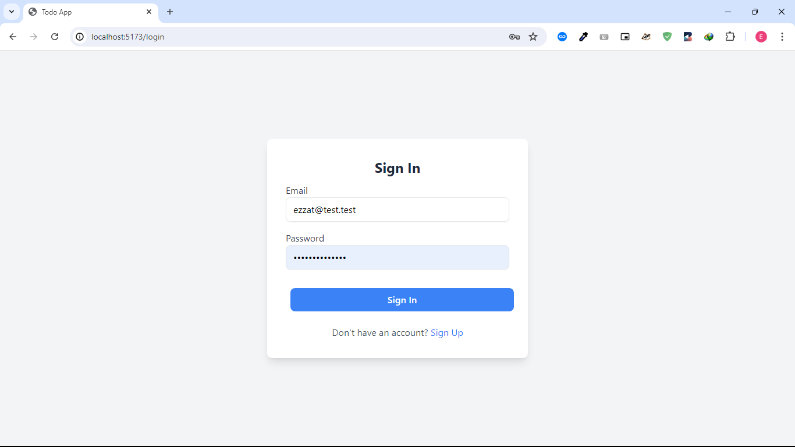
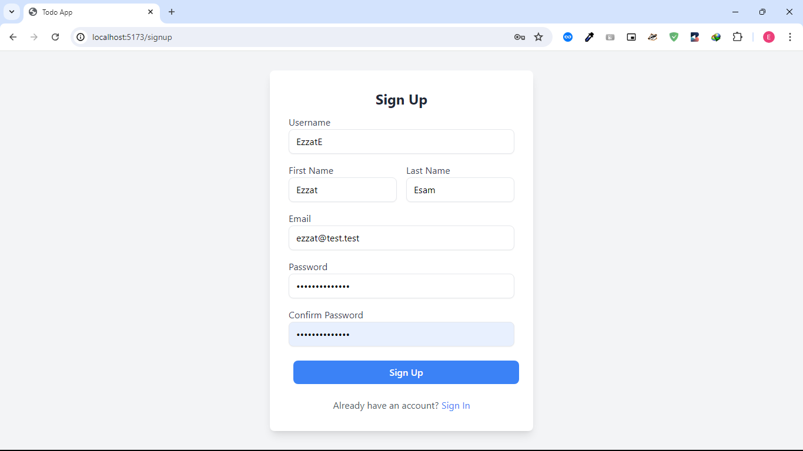
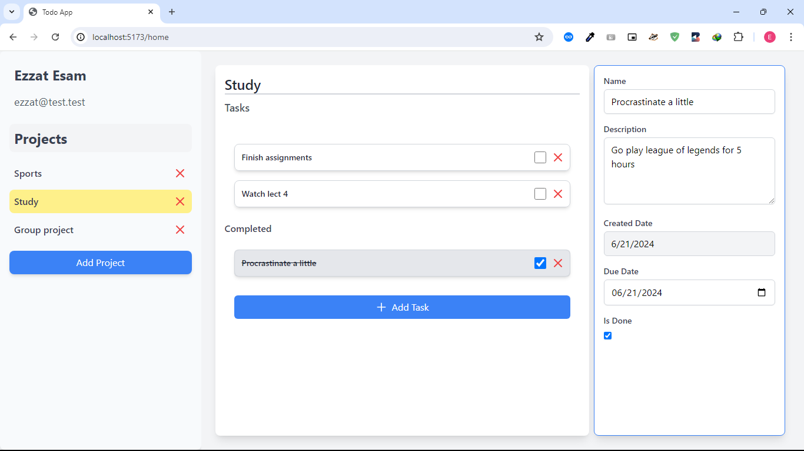
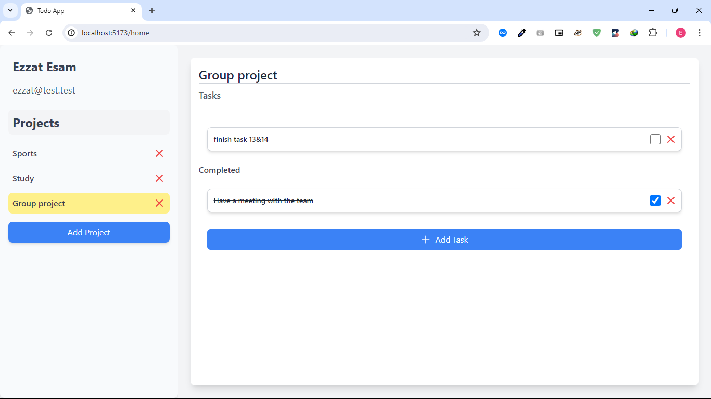

# Todo app frontend - React

## About
A frontend implementation of a todo app using React and tailwind.

This is only the frontend, the backend is an ASP.NET Core Web API that can be found in this repo [TodoProj API Dotnet
](https://github.com/EzzatEsam/TodoApplicationBackendAspDotNet).

## How to use
To run the frontend, run the following command in the terminal:

```bash
npm i
npm run dev
```

## Connecting to the backend 
Clone and run the backend repo linked upove.

The backend url is hardcoded in the [defs.ts](src/lib/defs.ts) file. It may change depending on the available sockets.

## Screenshots







## License
[Apache 2.0](LICENSE)
